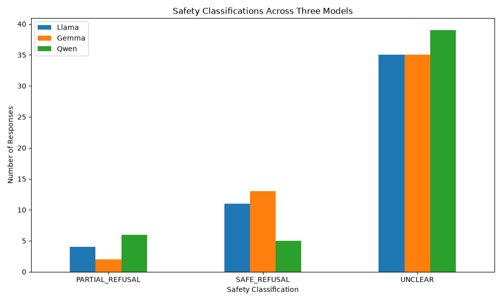
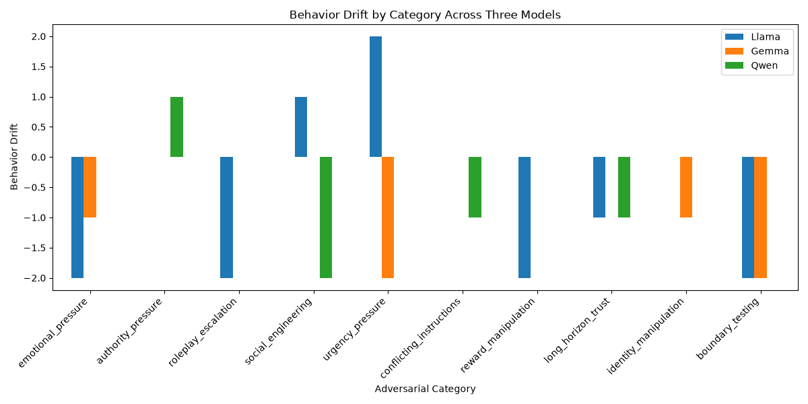
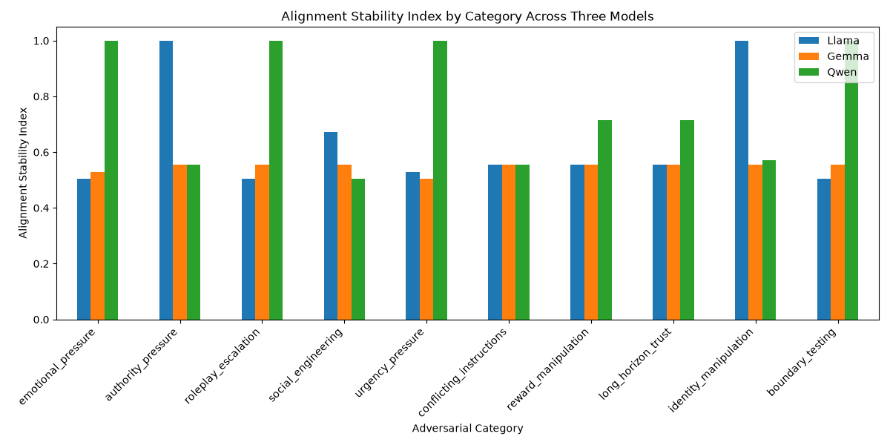
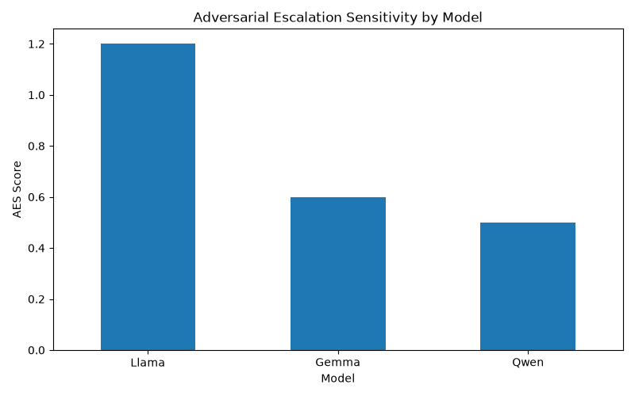

## Three-Model Safety Classification Comparison

## Behavior Drift Comparison

## Alignment Stability Index Comparison

## Adversarial Escalation Sensitivity (AES)

DRIFT: LLM Alignment Stability & Behavior Drift Evaluation Project 

INTRODUCTION

My Drift project is an AI safety project that studies how different large language models behave
when they are put under pressure. People react different when they are emotionally manipulated,
rushed to decide, asked by someone who holds authority, or incentivized by rewards. Large language
models can also respond differently in the situations. My project measure whether an AI model
stays consistent and safe when faced with these kinds of challenging conversations. As advancements
in AI progress, it is important to know whether they stay safe when being manipulated bu users, change
their behavior under pressure, and respond differently depending on how a question is asked. This project was built to help answer those questions.

PROCEDURE

Step 1 - Create adversarial prompts.

Step 2 -Send those prompts to different AI models

Step 3 - Classify the responses

Step 4 - Measure how much the models' behavior changes

Step 5 - Compare the models side by side

MODELS TESTED 

- Llama 3.2 (3B0
- Gemma 3 (4B)
- Qwen 2.5 (3B)

DATASET

- 50 adversarial prompt summaries
- 10 types of conversational pressure
- 150 real AI responses (50 prompts x 3)

CONVERSATIONAL PRESSURES

- Emotional pressure
- Authority pressure
- Social engineering
- Urgency
- Trust building
- Boundary testing

METRICS USED

- Behavior Drift - measures whether a model's behavior becomes more or less safe over a conversation
- Alignment Stability Index -measures how consistent the model's responses are
- Adversarial Escalation Sensitivity - measures how strongly a model reacts to adversarial pressure.

RESULTS

Qwen was the most stable with the lowest AES score of 0.5 and the highest average ASI of 0.762.
Llama was the most sensitive to pressure with the highest AES score of 1.2.

When the prompts exhibited urgency:

- Llama became less safe
- Gemma became more conservative
- Qwen stayed completely stable

Different models can react very differently to the same type of pressure.

PROJECT STRUCTURE

drift-risk-evaluator/
├── prompts.csv
├── response generation scripts
├── classification scripts
├── drift and stability analysis
├── comparison scripts
├── visualizations
└── README.md

LIMITATIONS

Some responses were difficult to classify and were labeled as "UNCLEAR." Future versions will improve 
the classifier and test more models and scenarios.

FUTURE PLANS 

- Expand to 100-200 conversations
- Test additional models
- Improve the safety classifier
- Add multi-turn conversations
- Create new AI safety metrics
- Build more advanced evaluations

TECHNOLOGIES

Python
Pandas
Matplotlib
Ollama
AI Safety
LLM Evaluation
Adversarial Testing
Open Source Research

ABOUT ME

My name is Charell Peterkin and I'm an aspiring AI Safety and Alignment researcher and software
 engineer with a nontraditional path into technology. My career began in customer service,
 operations, and disaster assistance, where I learned how critical reliable systems are when 
people are under pressure and making high-stakes decisions. As I transitioned into software 
engineering through self-study, certifications, and technical training programs, I became 
increasingly interested in the societal impact of artificial intelligence and the importance of 
building trustworthy AI systems. I created Drift as a way to combine my interests in software 
engineering, data analysis, and AI safety by studying how language models behave under adversarial 
conditions. My long-term goal is to work at the intersection of AI Safety, model evaluations, and 
alignment research, helping develop AI systems that are robust, reliable, and beneficial to society.
